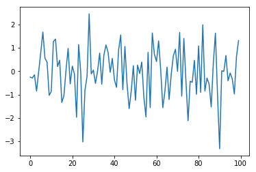
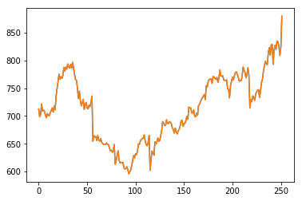
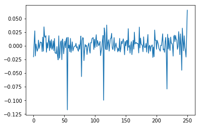
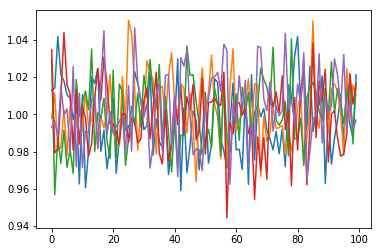
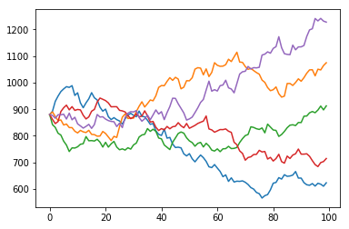

## Verify Install
---
Verify numpy is installed

~~~
(testEnv) $ conda list | egrep 'numpy'
numpy                     1.13.3
~~~
{: .bash}
*Note: This module assumes you are using anaconda3. Anaconda has it's own package manager called conda. For standard python use pip. ex:*

~~~
(testEnv) $ pip freeze | egrep 'numpy'
numpy==1.13.3
~~~
{: .bash}

If numpy is not installed, install it with conda:

~~~
(testEnv) $ conda install numpy
~~~
{: .bash}

If you are using standard python and numpy is not installed, install it with pip:

~~~
(testEnv) $ pip install numpy
~~~
{: .bash}

## NumPy Arrays
---
NumPy is the fundamental package for scientific computing with Python.  NumPy's main 
object is a homogeneous multi-dimensional array. NumPy's array class is 
called ndarray. NumPy's array class differs from standard Python's array class in that
a standard Python array is only one dimensional. 

Create a two dimensional array with:

~~~
import numpy as np

a = np.array([[0,1,2,3],[4,5,6,7]])
~~~
{: .python}

The basic NumPy functions are:

**numpy.shape**: returns a tuple with one integer for each dimension. Each integer represents 
the length of that dimension.

**numpy.size**: returns the total number of elements in the array. ie the product of the dimensions
returned by np.shape()

**numpy.dtype**: returns the datatype of the elements

~~~
print(a.shape)
print(a.size)
print(a.dtype)
~~~
{: .python}

To create a range of numbers numpy provides the `arange` function similar to python's `range`

~~~
print(np.arange(0,100,1))
print(np.arange(0,30,.3))
~~~
{: .python} 

Numpy also provides `linspace(X,Y,N)` which creates an array of N evenly spaced numbers between X and Y

~~~
print(np.linspace(0,20,15))
~~~
{: .python}

## Basic NumPy Operations
---

Arithmetic operations on NumPy arrays are elementwise:

~~~
x = np.ones((4,4))*3
y = np.linspace(0,3,16).reshape(4,4)
z = x-y
print(z)
~~~
{: .python}

NumPy provides the `dot()` function for the dot product

~~~
z = x.dot(y)
z = np.dot(x,y)
print(z)
~~~
{: .python}

NumPy also provides in place operators like `+=` and `*=`

~~~
y += x
y -= x
z *= x
print(z)
~~~
{: .python}

NumPy all the features of a good scientific calculater and then sum:

~~~
# sums all values of y
y.sum()
# sums all values along an axis
y.sum(axis=0)
y.sum(axis=1)
# cumulative sum along an axis
y.cumsum(axis=0)
y.cumsum(axis=1)

# elementwise square root
np.sqrt(y)

# sine function
np.sin(np.arange(0,2*np.pi,.1))
~~~
{: .python} 

## NumPy Financial Functions
---

NumPy includes it's own set of basic 
[financial functions](https://docs.scipy.org/doc/numpy/reference/routines.financial.html) 
as well:

~~~
# Compute the payment against loan principal plus interest
# What is the monthly payment needed to pay off a $200,000 loan in 15 years at an annual interest rate of 7.5%?
np.pmt(0.075/12, 12*15, 200000)

# Return the Internal Rate of Return (IRR).
# This is the “average” periodically compounded rate of return that gives a net present value of 0.0
np.irr([-100, 39, 59, 55, 20])
~~~
{: .python}

## Economic example using NumPy

Random numbers are crucial in many simulations and models, including Monte Carlo simulations.  NumPy provides a variety of 
[random number generators](https://docs.scipy.org/doc/numpy-1.15.4/reference/routines.random.html)
including many of the most common distributions.

~~~
import matplotlib.pyplot as plt
x = np.random.randn(100)
plt.plot(x)
plt.show()
~~~
{: .python}

Let's run through a Monte Carlo simulation predicting stock values for Autozone.  
Download the following file into your data directory: [AZO Adjusted Close](../files/AZOadj.csv)
Load the file using np.loadtxt() and display it:

~~~
data = np.loadtxt('AZOadj.csv')
plt.plot(data)
plt.show()
~~~
{: .python}

Calculate the log returns and plot them:

~~~
log_returns = np.diff(np.log(data))
plt.plot(log_returns)
plt.show()
~~~
{: .python}

Next calculate the mean (u), variance (var), Standard deviation (std) and drift (drift)

~~~
u = log_returns.mean()
var = log_returns.var()
std = log_returns.std()
drift = u-(0.5*var)
~~~
{: .python}

Say we want to run 5 simulations predicting the next 100 days of returns.  First generate 
a 2 dimensional array of random values of size (100,5):

~~~
rand_vals = np.random.rand(100, 5)
print(rand_vals.shape)
~~~
{: .python}
~~~
(100, 5)
~~~
{: .output}

Next with some help from SciPy's statistical library let's calculate the percent point function
using our random values:

~~~
from scipy.stats import norm
ppf = norm.ppf(rand_vals)
~~~
{: .python}

Calculate the daily returns using the results of our previous step and plot them:

~~~
returns = np.exp(drift + std*ppf)
plt.plot(returns)
plt.show()
~~~
{: .python}

Convert this back to daily stock values by creating an empty 2 dimensional array the same size 
as our returns and assign the first row (starting values) to be the same as the last row in our 
initial data set.  Then loop through our data calculating the daily values and plot it

~~~
predictions = np.zeros(returns.shape)
predictions[0] = data[-1]
for i in range(1,predictions.shape[0]):
    predictions[i] = predictions[i-1]*returns[i]
plt.plot(predictions)
plt.show()
~~~
{: .python}

> ## Rerun the Simulation
> 
> Rerun the simulation several times to see how the results vary.  Why do they vary?
> > ## Solution
> > 
> > ~~~
> > # Load the data
> > data = np.loadtxt('AZOadj.csv')
> > # calculate the log returns
> > log_returns = np.diff(np.log(data))
> > # calculate the mean, variance, standard deviation and drift
> > u = log_returns.mean()
> > var = log_returns.var()
> > std = log_returns.std()
> > drift = u-(0.5*var)
> > # generate random series
> > rand_vals = np.random.rand(100, 5)
> > # calculate the percent point function
> > from scipy.stats import norm
> > ppf = norm.ppf(rand_vals)
> > # Calculate daily the returns
> > returns = np.exp(drift + std*ppf)
> > # Convert this back to daily stock values and plot
> > predictions = np.zeros(returns.shape)
> > predictions[0] = data[-1]
> > for i in range(1,predictions.shape[0]):
> >     predictions[i] = predictions[i-1]*returns[i]
> > plt.plot(predictions)
> > plt.show()
> > ~~~
> > {: .python}
> > 
> {: .solution}
{: .challenge}

> ## Different Distributions
> 
> Modify the simulation to use a different random distribution ([NumPy.random](https://docs.scipy.org/doc/numpy-1.15.4/reference/routines.random.html))
> 
> > ## Solution
> > 
> > ~~~
> > # Load the data
> > data = np.loadtxt('AZOadj.csv')
> > # calculate the log returns
> > log_returns = np.diff(np.log(data))
> > # calculate the mean, variance, standard deviation and drift
> > u = log_returns.mean()
> > var = log_returns.var()
> > std = log_returns.std()
> > drift = u-(0.5*var)
> > # generate random series
> > rand_vals = np.random.beta(a=2,b=1,size=(100, 5))
> > # calculate the percent point function
> > from scipy.stats import norm
> > ppf = norm.ppf(rand_vals)
> > # Calculate daily the returns
> > returns = np.exp(drift + std*ppf)
> > # Convert this back to daily stock values and plot
> > predictions = np.zeros(returns.shape)
> > predictions[0] = data[-1]
> > for i in range(1,predictions.shape[0]):
> >     predictions[i] = predictions[i-1]*returns[i]
> > plt.plot(predictions)
> > plt.show()
> > ~~~
> > {: .python}
> > 
> {: .solution}
{: .challenge}