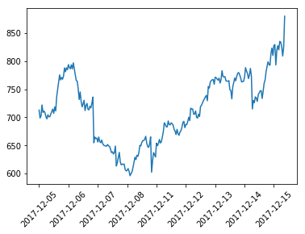
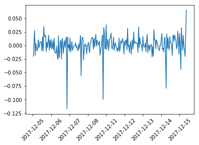
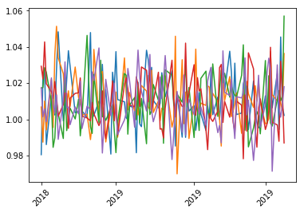
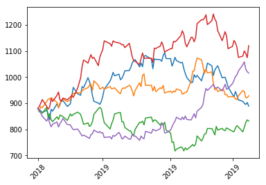

[Pandas](https://pandas.pydata.org/) is an open source library which provides data structures and 
data analysis tools for python.  You will notice many similarities between Pandas and NumPy because 
Pandas is built on top of NumPy using and expanding on NumPy's functionality.  At the core of Pandas
is the pandas dataframe.  Dataframes are similar to multi-dimensional arrays but they include labels 
and indices which can be of many types including time, simplifying the use of time series data.

## Creating DataFrames 
---
The Pandas DataFrame class is used to manage labeled and indexed data much like one would in SQL.

To import the Pandas library do the following:

~~~
import pandas as pd
~~~
{: .python}

Pandas DataFrame is created with the form:

~~~
pd.DataFrame(Data,Labels,Index)
~~~
{: .python}

Create and print a Pandas DataFrame with:

~~~
df = pd.DataFrame([10,20,30,40],columns=['numbers'],index=['a','b','c','d'])
print(df)
~~~
{: .python}
~~~
   numbers
a       10
b       20
c       30
d       40
~~~
{: .output}

The main concepts to take away from a Pandas DataFrame are:

- **Data:** can be one of the following (list,tuple,ndarray,dict)
- **Labels:** data organized into columns which can have custom names 
- **Index:** index that can take on different formats (numbers, strings, time information)

We can print out the labels and index of the DataFrame:

~~~
print(df.index)
print(df.columns)
~~~
{: .python}
~~~
Index(['a', 'b', 'c', 'd'], dtype='object')
Index(['numbers'], dtype='object')
~~~
{: .output}

We can also initialize a Pandas DataFrame by calling the underlying Numpy function 'ones' and 
wrapping it with a Pandas DataFrame:

~~~
df1 = pd.DataFrame(pd.np.ones((3,3)))
print(df1)
~~~
{: .python}
~~~
     0    1    2
0  1.0  1.0  1.0
1  1.0  1.0  1.0
2  1.0  1.0  1.0
~~~
{: .output}

We passed the ones function a tuple of (3,3) which will create a 3 by 3 matrix initialized with 
the values of 1 and then wrap the Numpy array in a Pandas DataFrame. We can also use the zeros 
function to initialize the DataFrame with values of zero:

~~~
df0 = pd.DataFrame(pd.np.zeros((3,3)))
print(df0)
~~~
{: .python}
~~~
     0    1    2
0  0.0  0.0  0.0
1  0.0  0.0  0.0
2  0.0  0.0  0.0
~~~
{: .output}

We can append data to the end of our dataframe with `append`:

~~~
df2 = pd.DataFrame([50,60,70,80],columns=['numbers'],index=['e','f','g','h'])
df = df.append(df2)
print(df)
~~~
{: .python}
~~~
   numbers
a       10
b       20
c       30
d       40
e       50
f       60
g       70
h       80
~~~
{: .output}

We can add a column to our dataframe by assigning values to it's label:

~~~
df['10x'] = df.numbers*10
print(df)
~~~
{: .python}
~~~
   numbers  10x
a       10  100
b       20  200
c       30  300
d       40  400
e       50  500
f       60  600
g       70  700
h       80  800
~~~
{: .output}

Pandas has more ways to concatenate data than we can cover in this workshop.  For more information
on concatenating data please visit Pandas [merging](https://pandas.pydata.org/pandas-docs/stable/merging.html)
documentation

## Indexing DataFrames
---
Pandas has two primary types of indexing:

**.loc**: is label and index based:

~~~
print(df.loc['a'])
print('----------------')
print(df.loc['a','10x'])
print('----------------')
print(df.loc['a':'d','10x'])
~~~
{: .python}
~~~
numbers     10
10x        100
Name: a, dtype: int64 
----------------
100 
----------------
a    100
b    200
c    300
d    400
Name: 10x, dtype: int64 
~~~
{: .output}

**.iloc**: is integer position based (from 0 to length-1)

~~~
print(df.iloc[0])
print('----------------')
print(df.iloc[0,1])
print('----------------')
print(df.iloc[0:3,1])
~~~
{: .python}
~~~
numbers     10
10x        100
Name: a, dtype: int64 
----------------
100 
----------------
a    100
b    200
c    300
Name: 10x, dtype: int64 
~~~
{: .output}

## Importing and Exporting data from CSV files
---

We can write our dataframe out to a CSV file with:

~~~
df.to_csv('numbers.csv')
!cat numbers.csv
~~~
{: .python} 
~~~
,numbers,10x
a,10,100
b,20,200
c,30,300
d,40,400
e,50,500
f,60,600
g,70,700
h,80,800
~~~
{: .output}

We can read in CSV data into a DataFrame ([AZO.csv](../files/AZO.csv)):

~~~
df = pd.read_csv('AZO.csv')
~~~
{: .python}

*Note: If an index column is not specified then pandas will create an index column for you starting with 0.*

Now that we have data inside of a DataFrame we can look at the DataFrame with a few commands:

~~~
print('head\n',df.head())
print('tail\n',df.tail())
~~~
{: .python}
~~~
head
          Date        Open        High         Low       Close   Adj Close  \
0  2017-12-05  747.000000  763.299988  703.599976  712.760010  712.760010   
1  2017-12-06  705.630005  711.760010  696.940002  698.650024  698.650024   
2  2017-12-07  701.460022  704.090027  693.750000  702.340027  702.340027   
3  2017-12-08  702.789978  723.429993  701.289978  721.890015  721.890015   
4  2017-12-11  719.590027  720.799988  705.780029  708.609985  708.609985   

    Volume  
0  1225500  
1   492900  
2   417300  
3   546900  
4   501900  
tail
            Date        Open        High         Low       Close   Adj Close  \
247  2018-11-28  835.380005  840.650024  826.599976  833.700012  833.700012   
248  2018-11-29  835.530029  836.739990  824.020020  825.830017  825.830017   
249  2018-11-30  827.090027  827.090027  804.570007  809.070007  809.070007   
250  2018-12-03  814.049988  829.710022  807.059998  824.460022  824.460022   
251  2018-12-04  867.099976  894.369995  854.500000  880.070007  880.070007   

     Volume  
247  349900  
248  279200  
249  602900  
250  535700  
251  935200 
~~~
{: .output}

## Working with Dataframes
---
There is a large variety of functions that pandas provides for Dataframes.  View Pandas 
[API reference](https://pandas.pydata.org/pandas-docs/stable/api.html) for documentation.
In this workshop we will review a few of them to give you an idea of their potential:

[DataFrame.sum()](https://pandas.pydata.org/pandas-docs/stable/generated/pandas.DataFrame.sum.html)
Sum the values on the requested axis (default is columns):

~~~
print(df.sum())
~~~
{: .python}
~~~
Date         2017-12-052017-12-062017-12-072017-12-082017-1...
Open                                                    180132
High                                                    182133
Low                                                     177975
Close                                                   180038
Adj Close                                               180038
Volume                                                92264300
dtype: object
~~~
{: .output}

[DataFrame.cumsum()](https://pandas.pydata.org/pandas-docs/stable/generated/pandas.DataFrame.cumsum.html#pandas.DataFrame.cumsum)
Return the cumulative sum of the requested axis:

~~~
print(df['Close'].cumsum().head())
~~~
{: .python}
~~~
0     712.760010
1    1411.410034
2    2113.750061
3    2835.640076
4    3544.250061
Name: Close, dtype: float64
~~~
{: .output}

[DataFrame.std()](https://pandas.pydata.org/pandas-docs/stable/generated/pandas.DataFrame.std.html#pandas.DataFrame.std)
Return the standard deviation of the requested axis:

~~~
print(df.std())
~~~
{: .python}
~~~
Open             59.753627
High             60.613944
Low              59.501632
Close            60.590288
Adj Close        60.590288
Volume       208536.419569
dtype: float64
~~~
{: .output}

## Economic example using Pandas

Let's repeat the example from NumPy using Pandas, this time using the file [AZO.csv](../files/AZO.csv) which includes time data

Load the file using `pd.read_csv` and plot just the adjusted close values:

*Note: There are a few extra commands included here to format the plot and make the dates visible.  Don't worry if you don't understand them now, we will cover more about matplotlib later*

~~~
import matplotlib.pyplot as plt

# simple function to format plot to make the dates legible
def plot_dates(df):
    fig, ax = plt.subplots()
    plt.plot(df)
    ax.set_xticks(df.index[0::30])
    plt.xticks(rotation=45)
    plt.show()

# read the data in and plot it
data = pd.read_csv('AZO.csv', index_col=0)
plot_dates(data['Adj Close'])
~~~
{: .python}

Next we'll calculate the log returns and plot them, this time using a pandas dataframe function called `pct_change()`.  We could use the same NumPy method for calculating the log returns, but using the pandas function we keep the indices for the data (dates)

~~~
import numpy as np

log_returns = np.log(1 + data['Adj Close'].pct_change())
plot_dates(log_returns)
~~~
{: .python}

Next calculate the mean (u), variance (var), Standard deviation (std) and drift (drift) the same way we did with NumPy

~~~
u = log_returns.mean()
var = log_returns.var()
std = log_returns.std()
drift = u-(0.5*var)
~~~
{: .python}

Say we want to run 5 simulations predicting the next 100 days of returns.  First generate 
a 2 dimensional array of random values of size (100,5), just like we did with NumPy:

~~~
rand_vals = np.random.rand(100, 5)
print(rand_vals.shape)
~~~
{: .python}
~~~
(100, 5)
~~~
{: .output}

Next with some help from SciPy's statistical library let's calculate the percent point function
using our random values:

~~~
from scipy.stats import norm
ppf = norm.ppf(rand_vals)
~~~
{: .python}

Calculate the daily returns using the results of our previous step and plot them:

~~~
returns = np.exp(drift + std*ppf)
plt.plot(returns)
plt.show()
~~~
{: .python}

Next with some help from Pandas we will determine what the next 100 business days are and merge set them as the indices for our daily returns

~~~
from pandas.tseries.holiday import USFederalHolidayCalendar
from pandas.tseries.offsets import CustomBusinessDay

us_bd = CustomBusinessDay(calendar=USFederalHolidayCalendar())
prediction_dates = pd.date_range(start=data.index[-1], periods=100, freq=us_bd)
returns_dates = pd.DataFrame(returns,index=prediction_dates)
plot_dates(returns_dates)
~~~
{: .python}

Convert this back to daily stock values by creating an empty dataframe the same size 
as our returns with our prediction dates as the indices and assign the first row (starting values) to be the same as the last row in our 
initial data set.  Then loop through our data calculating the daily values and plot it

~~~
predictions = pd.DataFrame(np.zeros(returns_dates.shape),index=prediction_dates)
predictions.iloc[0] = data['Adj Close'].iloc[-1]
for i in range(1,predictions.shape[0]):
    predictions.iloc[i] = predictions.iloc[i-1]*returns_dates.iloc[i]
predictions.head()
plot_dates(predictions)
~~~
{: .python}

> ## Challenge
> 
> Using the predictions from above pick a date and print the predicted stock values for all 5 predictions for that date
> > ## Solution
> > 
> > ~~~
> > print(predictions.loc['2018-12-26'])
> > ~~~
> > {: .python}
> > ~~~
> > 0    897.879181
> > 1    914.058514
> > 2    859.522983
> > 3    923.701527
> > 4    817.625782
> > Name: 2018-12-26 00:00:00, dtype: float64
> > ~~~
> > {: .output}
> > 
> {: .solution}
{: .challenge}

