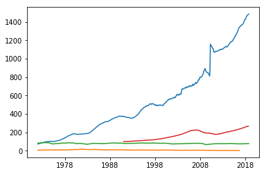
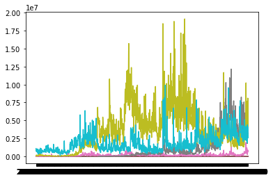

## Pandas-DataReader
---
We'll start with pandas-datareader, which is an extension of the pandas package and contains 
functions and classes for remote data access. Time constraints make covering the entire 
pandas-datareader package impossible. For information on functions not covered in this module please see: 
[https://pandas-datareader.readthedocs.io/en/latest/](https://pandas-datareader.readthedocs.io/en/latest/)

## Verify Install
---
First we'll verify that pandas and pandas-datareader are installed:

~~~
(testEnv) $ conda list | grep pandas
pandas                    0.22.0           py36hf484d3e_0  
pandas-datareader         0.5.0                    py36_0  
~~~
{: .bash}

*Note: This module assumes you are using anaconda3.  Anaconda has it's own package manager 
called conda.  For standard python use pip.  ex:*

~~~
(testEnv) $ pip freeze | grep pandas
pandas==0.22.0
pandas-datareader==0.5.0
~~~
{: .bash}

By default anaconda comes with pandas.  If pandas-datareader is not installed, install it with conda:

~~~
(testEnv) $ conda install pandas-datareader
~~~
{: .bash}

If you are using standard python and pandas and/or pandas-datareader are not installed, install it with pip:

~~~
(testEnv) $ pip install pandas pandas-datareader
~~~
{: .bash}

## Pulling data from FRED
---
FRED, short for **F**ederal **R**eserve **E**conomic **D**ata, is a database maintained by the Research 
division of the Federal Reserve Bank of St. Louis that has more than 498,000 economic time series from 
87 sources.  Browse their website [https://fred.stlouisfed.org/](https://fred.stlouisfed.org/) or go to 
[https://en.wikipedia.org/wiki/Federal_Reserve_Economic_Data](https://en.wikipedia.org/wiki/Federal_Reserve_Economic_Data) 
for a partial list of data series available through FRED.

Pandas-datareader requires start and end times for pulling data series so we will import the 
pandas_datareader and datetime packages and define start and end dates.

~~~
import pandas_datareader as pdr
import datetime

start = datetime.date(1972, 1, 1)
end = datetime.date(2018, 12, 1)

print(start,"-",end)
~~~
{: .python}
~~~
1972-01-01 - 2018-12-01
~~~
{: .output}

The base function for pandas_datareader is:

~~~
def DataReader(name, data_source=None, start=None, end=None,retry_count=3, pause=0.001, session=None, access_key=None):
Parameters
    ----------
    name : str or list of strs
        the name of the dataset. Some data sources (yahoo, google, fred) will
        accept a list of names.
    data_source: {str, None}
        the data source ("fred", "ff", or "edgar-index")
    start : {datetime, None}
        left boundary for range (defaults to 1/1/2010)
    end : {datetime, None}
        right boundary for range (defaults to today)
    retry_count : {int, 3}
        Number of times to retry query request.
    pause : {numeric, 0.001}
        Time, in seconds, to pause between consecutive queries of chunks. If
        single value given for symbol, represents the pause between retries.
    session : Session, default None
            requests.sessions.Session instance to be used
~~~

That's a lot of inputs!  Luckily the package has provided default values for most of them and you 
only have to worry about four:

 - name (this can be a list of names)
 - data_source
 - start
 - end
 
Let's give it a try with the "CONSUMER" dataseries:

~~~
df = pdr.data.DataReader("CONSUMER","fred", start, end)
print(df.head(n=5)) #show the first 5 results
df.size #show the size of our results
~~~
{: .python}
~~~
            CONSUMER
DATE                
1972-01-01   73.9491
1972-02-01   74.9702
1972-03-01   76.1145
1972-04-01   77.0567
1972-05-01   78.1100

562
~~~
{: .output}

*Note: you can omit the start and/or end date but beware the default for start is Jan. 1, 2010.
The default for end is today* 

Pandas-datareader has provided helper functions for some of the data sources reducing the number 
of inputs to three:

- name (this can be a list of names)
- start
- end

~~~
df = pdr.data.get_data_fred("CONSUMER", start, end)
print(df.head(n=5)) #show the first 5 results.  Should be the same as the above results
~~~
{: .python}
~~~
            CONSUMER
DATE                
1972-01-01   73.9491
1972-02-01   74.9702
1972-03-01   76.1145
1972-04-01   77.0567
1972-05-01   78.1100
~~~
{: .output}

pandas-datareader's default return type is a DataFrame so all the tools and functions you have 
learned thus far can be easily applied to the returned data.

~~~
print(type(df))
~~~
{: .python}
~~~
<class 'pandas.core.frame.DataFrame'>
~~~
{: .output}

Multiple data series can be pulled at the same time and returned in the same dataframe by 
using a list in place of a single name:

~~~
df = pdr.data.get_data_fred(["CONSUMER","MORTG","TCU"], start, end)
print(df.head(n=5)) #show the first 5 results.  Should be the same as the above results
~~~
{: .python}
~~~
            CONSUMER  MORTG      TCU
DATE                                
1972-01-01   73.9491   7.44  82.5918
1972-02-01   74.9702   7.33  83.1874
1972-03-01   76.1145   7.30  83.5808
1972-04-01   77.0567   7.29  84.2631
1972-05-01   78.1100   7.37  84.0076
~~~
{: .output}

> ## Challenge
> 
> Use the get_data_fred to pull four data series of your choice and plot using matplotlib:
> 
> > ## Solution
> > ~~~
> > import matplotlib.pyplot as plt
> > df = pdr.data.get_data_fred(["CONSUMER","MORTG","TCU","HPIPONM226S"], start, end)
> > plt.plot(df)
> > plt.show()
> > ~~~
> > {: .python}
> > 
> {: .solution}
{: .challenge}

## Pulling data from other data sources
---
You can access a plethora of data sources using pandas [data reader](https://pandas-datareader.readthedocs.io/en/latest/remote_data.html#)  
*Note: Yahoo and Google have changed their API and access is no longer reliable.*

### IEX
The Investors Exchange (IEX) provides historical stock prices for up to 5 years.

~~~
start = datetime.date.today() - datetime.timedelta(days=5*365)
df = pdr.data.DataReader("F",'iex',start,end)
print(df.tail(n=5))
~~~
{: .python}
~~~
            open  high   low  close    volume
date                                         
2018-11-26  9.23  9.53  9.17   9.40  46304425
2018-11-27  9.37  9.43  9.25   9.28  34283203
2018-11-28  9.27  9.44  9.17   9.41  33199483
2018-11-29  9.37  9.44  9.26   9.37  29207626
2018-11-30  9.37  9.48  9.36   9.41  36269456
~~~
{: .output}

### Challenge:

> ## Challenge
> 
> Use the pandas data reader to pull four quotes of your choice and plot the last value in a bar chart 
> using matplotlib: 
> 
> > ## Solution
> > ~~~
> > import matplotlib.pyplot as plt
> > start = datetime.date.today() - datetime.timedelta(days=5*365)
> > df = pdr.data.DataReader(["BNO","WTI","DRIP","UCO"],'iex',start,end)
> > plt.plot(df)
> > plt.show()
> > ~~~
> > {: .python}
> > 
> > 
> {: .solution}
{: .challenge}

## SQL Databases
--- 
Most databases use some form of SQL (Structured Query Language) and many of them do not have convenient API's like FRED or IEX.  For these databases we must mix Python with SQL.  In this section we will use SQLite, which is a self contained SQL database engine and will be enough for us to get our feet wet with SQL database interaction.

The basic element of most python SQL interaction is the `connection` object.  There are three primary functions associated with a `connection` object:
- cursor()
    Object used to interact with the database using SQL 
- commit()
    Saves (commits) changes
- close()
    closes the connection
    
The four most commonly used `cursor` functions are:
- execute()
    runs a single SQL command
- executemany()
    runs the same SQL command with many different inputs
- fetchone()
    pulls the first result from the cursor
- fetchall()
    pulls all the results from the cursor and saves them to an array

We'll start by importing `sqlite3`, creating a new connection to a new database and printing the sqlite version:

~~~
import sqlite3

conn = sqlite3.connect("myDatabase.db")
print(sqlite3.version)
~~~
{: .python}
~~~
2.6.0
~~~
{: .output}

Next we'll create a cursor, create a new table in our database, insert some data and commit the changes:

~~~
c = conn.cursor()
c.execute('CREATE TABLE stocks (date text, trans text, symbol text, qty real, price real)')
c.execute("INSERT INTO stocks VALUES ('2006-01-05','BUY','RHAT',100,35.14)")
conn.commit()
~~~
{: .python}

We can verify our data was written by reading it back out:

~~~
c.execute('SELECT * FROM stocks')
print(c.fetchone())
~~~
{: .python}
~~~
('2006-01-05', 'BUY', 'RHAT', 100.0, 35.14)
~~~
{: .output}

Usually database interaction is not this simple and we will want to construct SQL statements based on logic and variables.  Do not use standard python String construction methods, this leaves your program vulnerable to SQL injection attacks.  Instead, use the DB-API’s parameter substitution. Put ? as a placeholder wherever you want to use a value, and then provide a tuple of values as the second argument to the cursor’s execute() method

~~~
t = ('RHAT',)
c.execute('SELECT * FROM stocks WHERE symbol=?', t)
print(c.fetchone())
~~~
{: .python}
~~~
('2006-01-05', 'BUY', 'RHAT', 100.0, 35.14)
~~~
{:.output}

Multiple inserts can be done with the executemany command:

~~~
purchases = [('2006-03-28', 'BUY', 'IBM', 1000, 45.00),
             ('2006-04-05', 'BUY', 'MSFT', 1000, 72.00),
             ('2006-04-06', 'SELL', 'IBM', 500, 53.00),
            ]
c.executemany('INSERT INTO stocks VALUES (?,?,?,?,?)', purchases)
conn.commit()

c.execute('SELECT * FROM stocks')
print(c.fetchall())
~~~
{: .python}
~~~
[('2006-01-05', 'BUY', 'RHAT', 100.0, 35.14), ('2006-03-28', 'BUY', 'IBM', 1000.0, 45.0), ('2006-04-05', 'BUY', 'MSFT', 1000.0, 72.0), ('2006-04-06', 'SELL', 'IBM', 500.0, 53.0)]
~~~
{: .output}

When you are done working with your database make sure you close the connection:

~~~
conn.close()
~~~
{: .python}

## Pandas + SQL Databases
---
Pandas provides a collection of query wrappers ([Pandas SQL Queries](https://pandas.pydata.org/pandas-docs/stable/io.html#sql-queries))

You can write an entire dataframe into a table with a few commands:

~~~
import sqlite3
import pandas as pd

# create the connection to the DB
conn = sqlite3.connect("myDatabase.db")
# Read in the csv file into a Pandas DataFrame
df = pd.read_csv('AZO.csv',index_col=0)

# Write the entire DataFrame to a table called AZO
df.to_sql('AZO', con=conn, if_exists='replace')

# Read the data back out to verify
print(conn.execute("select * from AZO limit 5").fetchall())
# close the connection
conn.close()
~~~
{: .python}
~~~
[('2017-12-05', 747.0, 763.299988, 703.599976, 712.76001, 712.76001, 1225500), ('2017-12-06', 705.630005, 711.76001, 696.9400019999999, 698.650024, 698.650024, 492900), ('2017-12-07', 701.460022, 704.090027, 693.75, 702.340027, 702.340027, 417300), ('2017-12-08', 702.789978, 723.429993, 701.289978, 721.8900150000001, 721.8900150000001, 546900), ('2017-12-11', 719.590027, 720.799988, 705.780029, 708.6099849999999, 708.6099849999999, 501900)]
~~~
{: .output}

Saving a table or results of a query into a Dataframes is similar

~~~
# create the connection to the DB
conn = sqlite3.connect("myDatabase.db")
# run the query and save to df
df = pd.read_sql_query("SELECT * FROM AZO WHERE Date > '2018-06-01'",conn,index_col="Date")
# print the top 5 results
print(df.head())
conn.close()
~~~
{: .python}
~~~
                  Open        High         Low       Close   Adj Close  Volume
Date                                                                          
2018-06-04  653.500000  661.000000  653.190002  660.450012  660.450012  231000
2018-06-05  659.539978  661.140015  653.130005  654.140015  654.140015  230600
2018-06-06  657.590027  659.169983  652.580017  656.140015  656.140015  300800
2018-06-07  657.299988  669.140015  657.299988  664.809998  664.809998  305900
2018-06-08  663.299988  674.820007  661.989990  674.390015  674.390015  307600
~~~
{: .output}
