In this lab we will use pandas-datareader from the previous lesson to pull data and the matplotlib library to plot it.  
This lesson borrows heavily from the matplotlib tutorial:
[https://matplotlib.org/users/pyplot_tutorial.html](https://matplotlib.org/users/pyplot_tutorial.html)

Author: Greg Woodward

# matplotlib
Matplotlib is a library for creating quality figures with a few lines of code.  We will be using the pyplot module which
uses MATLAB like commands for creating simple plots.  For more documentation on matplotlib see:
[https://matplotlib.org/index.html](https://matplotlib.org/index.html)

## Verify Install
---
Since we will be using both pandas and matplotlib we will verify that both are installed

~~~
(testEnv) $ conda list | egrep 'pandas|matplotlib'
pandas                    0.22.0           py36hf484d3e_0  
pandas-datareader         0.5.0                    py36_0  
~~~
{: .bash}
*Note: This module assumes you are using anaconda3. Anaconda has it's own package manager called conda. For standard python use pip. ex:*

~~~
(testEnv) $ pip freeze | egrep 'pandas|matplotlib'
pandas==0.22.0
pandas-datareader==0.5.0
~~~
{: .bash}

If matplotlib or pandas-datareader is not installed, install it with conda:

~~~
(testEnv) $ conda install matplotlib pandas-datareader
~~~
{: .bash}

If you are using standard python and pandas and/or pandas-datareader are not installed, install it with pip:

~~~
(testEnv) $ pip install matplotlib pandas pandas-datareader
~~~
{: .bash}

## Basic plotting with matplotlib
---
Up until this point we have thrown data at matplotlib and let it figure out how to plot it.  This has worked well so far, but matplotlib has more potential.  We'll start with basic plotting to help us understand what matplotlib is doing and move to more complicated plots and plotting features

~~~
import matplotlib.pyplot as plt
plt.plot([1,2,3,4])
plt.ylabel('some numbers')
plt.show()
~~~
{: .python}

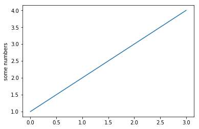

If you provide a single list or array of values to the plot() command matplotlib
assumes they are Y values and automatically generates X values for you starting
with 0. To plot X vs Y, pass plot() a second list or array of values:

~~~
plt.plot([1, 2, 3, 4], [1, 4, 9, 16])
plt.show()
~~~
{: .python}
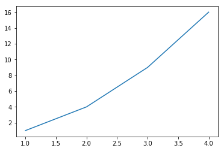

For every X,Y pair of arguments there is an optional format string that indicates
the color and line type of the pair. The letters and symbols of the format string
are from MATLAB, and you concatenate a color string with a line style string. The
default format string is 'b-', solid blue line. To change the above line to red
dots you would use:

See [plot()](https://matplotlib.org/api/pyplot_api.html#matplotlib.pyplot.plot)
for a complete list of colors and line styles

~~~
x = [1, 2, 3, 4]
y = [1, 4, 9, 16]
plt.plot(x, y,'ro')
plt.show()
~~~
{: .python}
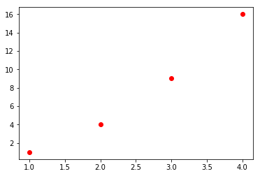

To change the viewport (or viewable area) use the axis() command which takes a
list of [xmin, xmax, ymin, ymax]:

~~~
plt.plot(x, y, 'ro')
plt.axis([0, 6, 0, 20])
plt.show()
~~~
{: .python}
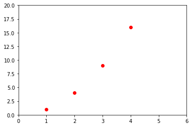

Under the hood matplotlib will convert all input arrays or lists to numpy arrays.
The example below illustrates plotting several lines with different format styles:

~~~
import numpy as np
# evenly sampled time at 200ms intervals
t = np.arange(0., 5., 0.2)
​
# red dashes, blue squares and green triangles
plt.plot(t, t, 'r--', t, t**2, 'bs', t, t**3, 'g^')
plt.show()
~~~
{: .python}
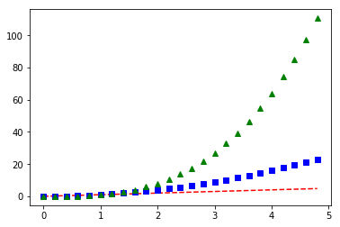


## Line Properties
---
Lines have many attributes you can set: linewidth, dash style, antialiased, etc.
See [matplotlib.lines.Line2D]( https://matplotlib.org/api/lines_api.html#matplotlib.lines.Line2D).

Line attributes can be set several different ways

* **Use keyword args:**

~~~
plt.plot(x,y, linewidth=4.0)
plt.show()
~~~
{: .python}
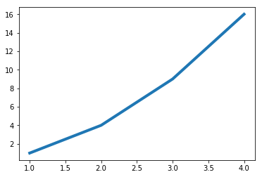

* **Use the setter methods of a Line2D instance:**  plot returns a list of Line2D objects.
In the code below we will only plot one line so that the list returned is
of length 1.  We use tuple unpacking with `line,` to get the first element of that list.  
See [matplotlib.lines](https://matplotlib.org/api/lines_api.html#matplotlib.lines.Line2D.set_linestyle)
for a list of line style setters

~~~
line, = plt.plot(x,y,'-')
line.set_antialiased(False) #turn off Antialiasing
plt.show()
~~~
{: .python}


* **Use the [setp()](https://matplotlib.org/api/pyplot_api.html#matplotlib.pyplot.setp) command:**
The example below uses a MATLAB-style command to set multiple properties on a list of lines.
setp works transparently with a list of objects or a single object.  You can either use python
keyword arguments or MATLAB-stype string/value pairs:

~~~
lines = plt.plot(x, y, x, np.power(y,2))
# use keyword args
plt.setp(lines, color='r', linewidth=2.0)
# or MATLAB style string value pairs
plt.setp(lines, 'color', 'r', 'linewidth', 2.0)
plt.show()
~~~
{: .python}
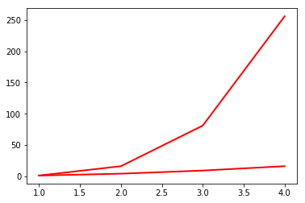

See [here](https://matplotlib.org/api/lines_api.html#matplotlib.lines.Line2D) for a list of available
properties or call the setp() function with a line or lines as the argument:

~~~
plt.setp(lines)
~~~
{: .python}
~~~
  agg_filter: a filter function, which takes a (m, n, 3) float array and a dpi value, and returns a (m, n, 3) array 
  alpha: float (0.0 transparent through 1.0 opaque) 
  animated: bool 
  antialiased or aa: bool 
  clip_box: a `.Bbox` instance 
  clip_on: bool 
  clip_path: [(`~matplotlib.path.Path`, `.Transform`) | `.Patch` | None] 
  color or c: any matplotlib color 
  contains: a callable function 
  dash_capstyle: ['butt' | 'round' | 'projecting'] 
  dash_joinstyle: ['miter' | 'round' | 'bevel'] 
  dashes: sequence of on/off ink in points 
  drawstyle: ['default' | 'steps' | 'steps-pre' | 'steps-mid' | 'steps-post'] 
  figure: a `.Figure` instance 
  fillstyle: ['full' | 'left' | 'right' | 'bottom' | 'top' | 'none'] 
  gid: an id string 
  label: object 
  linestyle or ls: ['solid' | 'dashed', 'dashdot', 'dotted' | (offset, on-off-dash-seq) | ``'-'`` | ``'--'`` | ``'-.'`` | ``':'`` | ``'None'`` | ``' '`` | ``''``]
  linewidth or lw: float value in points 
  marker: :mod:`A valid marker style <matplotlib.markers>`
  markeredgecolor or mec: any matplotlib color 
  markeredgewidth or mew: float value in points 
  markerfacecolor or mfc: any matplotlib color 
  markerfacecoloralt or mfcalt: any matplotlib color 
  markersize or ms: float 
  markevery: [None | int | length-2 tuple of int | slice | list/array of int | float | length-2 tuple of float]
  path_effects: `.AbstractPathEffect` 
  picker: float distance in points or callable pick function ``fn(artist, event)`` 
  pickradius: float distance in points
  rasterized: bool or None 
  sketch_params: (scale: float, length: float, randomness: float) 
  snap: bool or None 
  solid_capstyle: ['butt' | 'round' |  'projecting'] 
  solid_joinstyle: ['miter' | 'round' | 'bevel'] 
  transform: a :class:`matplotlib.transforms.Transform` instance 
  url: a url string 
  visible: bool 
  xdata: 1D array 
  ydata: 1D array 
  zorder: float 
~~~
{: .output}

## Using dataframes
---
In this section we will pull data from FRED and plot the data. 
- **HPIPONM226S** is the Purchase Only House Price Index for the United States 
- **MSACSR** is the Monthy Supply of Houses in the United States

~~~
import pandas_datareader as pdr
import datetime as dt
start = dt.datetime(2005,1,1)
end = dt.datetime.today()
df = pdr.data.get_data_fred(['HPIPONM226S','MSACSR'], start = start, end = end)
print(df.tail())
~~~
{: .python}
~~~
            HPIPONM226S  MSACSR
DATE                           
2018-06-01       264.28     6.0
2018-07-01       265.38     6.2
2018-08-01       266.44     6.4
2018-09-01       266.92     6.5
2018-10-01          NaN     7.4
~~~
{: .output}


Let's plot our data with a basic plot command
~~~
plt.plot(df)
plt.show()
~~~
{: .python}
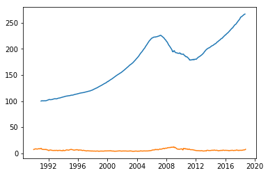

Note that matplotlib automatically selected the Date column for X values and gave our two columns different colors

## Working with multiple figures and axes
---
In pyplot, it is possible to have multiple figures and axes all plotting commands apply to the current figure and axis. The function
[gca()](https://matplotlib.org/api/pyplot_api.html#matplotlib.pyplot.gca) returns the current axes, and
[gcf()](https://matplotlib.org/api/pyplot_api.html#matplotlib.pyplot.gcf) returns the current figure.
Normally you don't have to worry about this because it's all taken care of for you. Below we will plot
our housing data in two separate subplots in the same figure:

~~~
plt.figure(1)
plt.subplot(211)
plt.plot(df.HPIPONM226S, '--')
plt.title('Purchase Only House Price Index for the United States')

plt.subplot(212)
plt.plot(df.MSACSR)
plt.title('Monthly Supply of Houses in the United States')

plt.show()
~~~
{: .python}
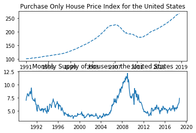

With these two plots in separate subplots we can see more variation in the Monthly supploy of houses.
Note that the tick labels, axis labels and titles have written over eachother. Use ```plt.tight_layout()```
to automatically adjust the subplot params to make space for tick labels, axis labels and titles.

~~~
plt.figure(1)
plt.subplot(211)
plt.plot(df.HPIPONM226S, '--')
plt.title('Purchase Only House Price Index for the United States')

plt.subplot(212)
plt.plot(df.MSACSR)
plt.title('Monthly Supply of Houses in the United States')

plt.tight_layout()

plt.show()
~~~
{: .python}
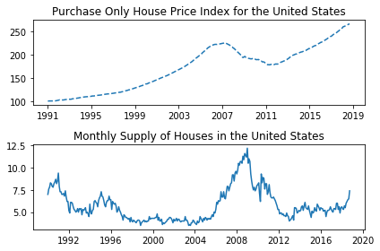


```plt.figure(1)``` is optional because the figure will be created by default just as ```subplot(111)``` will
be created by default if not otherwise specified. The
[subplot()](https://matplotlib.org/api/pyplot_api.html#matplotlib.pyplot.subplot) command specifies
number of rows, number of columns and the subplot number (nrows, ncols, plot_number).  The commas in
the subplot command are optional if nrows*ncols < 10. So ```subplot(211)``` is the same as ```subplot(2,1,1)```.
You can create an arbitrary number of subplots and axes. If you want to place an axes manually
(not on a rectangular grid) use the [axes()](https://matplotlib.org/api/pyplot_api.html#matplotlib.pyplot.axes)
command, which allows you to specify the locations as axes ([left, bottom, width, height]) where all values are
in fractional (0 to 1) coordinates.

You can create multiple figures by using multiple ```figure()``` calls with an increasing figure number.
Each Figure can contain as many axes and subplots as you desire.

~~~
plt.figure(1)
plt.plot(df.HPIPONM226S, '--')
plt.title('Purchase Only House Price Index for the United States')

plt.figure(2)
plt.plot(df.MSACSR)
plt.title('Monthly Supply of Houses in the United States')

plt.show()
~~~
{: .python}
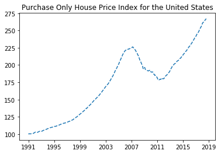 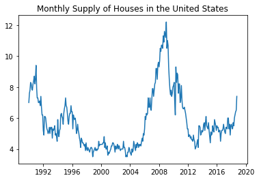

[figure()](https://matplotlib.org/api/figure_api.html) has its own configurable properties so we can change
the size, dpi, facecolor, edgecolor, linewidth, frame, or layout just like we would with lines in a plot:

~~~
plt.figure(1,figsize=(16,4))
plt.plot(df.HPIPONM226S, '--')
plt.title('Purchase Only House Price Index for the United States')
plt.show()

plt.figure(2,figsize=(8,4), facecolor=(0.6, 0.6, 0.6)) #using RGB color values
plt.plot(df.MSACSR)
plt.title('Monthly Supply of Houses in the United States')
plt.show()
~~~
{: .python}
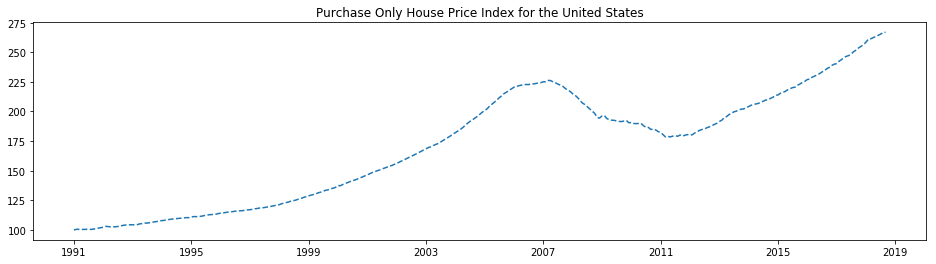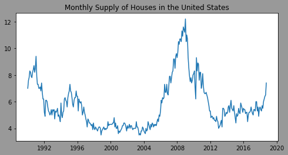

You can clear the current figure with [clf()](https://matplotlib.org/api/pyplot_api.html#matplotlib.pyplot.clf)
and the current axes with [cla()](https://matplotlib.org/api/pyplot_api.html#matplotlib.pyplot.cla).  

If you working with a lot of figures you need to be aware that the memory required for a figure is not completely
released until the figure is explicitly closed with [close()](https://matplotlib.org/api/pyplot_api.html#matplotlib.pyplot.close).

## Working with text
---
The [text()](https://matplotlib.org/api/pyplot_api.html#matplotlib.pyplot.text) command can be used to add text in
an arbitrary location, and the [xlabel()](https://matplotlib.org/api/pyplot_api.html#matplotlib.pyplot.xlabel),
[ylabel()](https://matplotlib.org/api/pyplot_api.html#matplotlib.pyplot.ylabel) and
[title()](https://matplotlib.org/api/pyplot_api.html#matplotlib.pyplot.title) are used to add text in the
indicated locations.

To make this more interesting we will be working with a subset of our HPI data:
~~~
hpi = df.HPIPONM226S.loc['2005-01-01':'2015-01-01']
~~~
{: .python}

We will add a ylabel with `plt.ylabel()`. Hopefully the x axis is obvious but a label could be added with ```plt.xlabel('date')```.
We'll add text to indicate the min and max of the plot.  We'll also set the y axes limits with ```axes.set_ylim``` to
make a cleaner plot.

~~~
plt.figure(figsize=(16,6))
plt.plot(hpi)

plt.title('House Price Index for the United States (HPIPONM226S)')
plt.grid(True)

axes = plt.gca()
axes.set_ylim([160, 240])
axes.set_xlim([hpi.index[0],hpi.index[-1]])

plt.text(
    hpi.idxmin(),hpi.min(),
    'Min: '+str(hpi.min())+'\n'+hpi.idxmin().strftime('%Y-%m-%d')
)
plt.text(
    hpi.idxmax(),hpi.max(),
    'Max: '+str(hpi.max())+'\n'+hpi.idxmax().strftime('%Y-%m-%d')
)

plt.show()
~~~
{: .python}
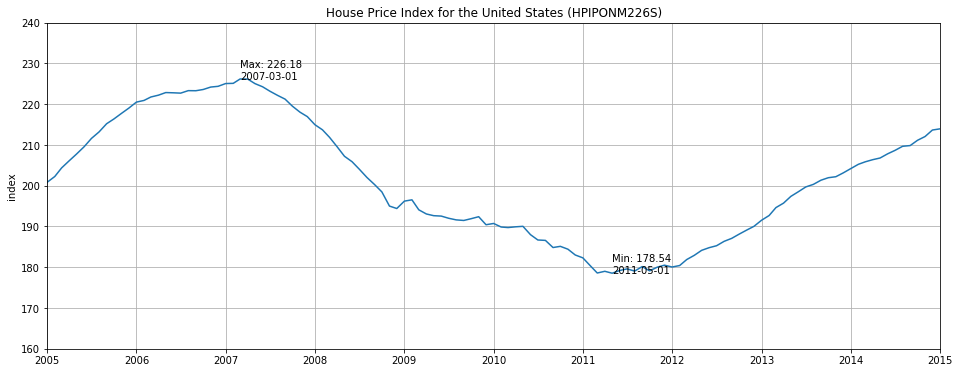


## Annotating text
---
The uses of the basic [text()](https://matplotlib.org/api/pyplot_api.html#matplotlib.pyplot.text) command above place
text at an arbitrary position on the axes.  A common use for text is to annotate some feature of the plot and the
[annotate()](https://matplotlib.org/api/pyplot_api.html#matplotlib.pyplot.annotate) method provides helper functions
to make annotations easy.  In an annotation, there are two points to consider: The location being annotated represented
by the argument xy and the location of the xytext.  Both of these arguments are (x,y) tuples.

~~~
from datetime import datetime

plt.figure(figsize=(16,6))

plt.plot(hpi)

plt.ylabel('index')
plt.title('House Price Index for the United States (HPIPONM226S)')
plt.grid(True)

axes = plt.gca()
axes.set_ylim([160, 240])
axes.set_xlim([hpi.index[0],hpi.index[-1]])

plt.text(hpi.idxmin(),hpi.min(),'Min: '+str(hpi.min())+'\n'+hpi.idxmin().strftime('%Y-%m-%d'))
plt.text(hpi.idxmax(),hpi.max(),'Max: '+str(hpi.max())+'\n'+hpi.idxmax().strftime('%Y-%m-%d'))


plt.annotate('When I bought my house\n'+str(hpi.loc['2005-12-01']),#String to be printed
             xy=(datetime.strptime('2005-12-01','%Y-%m-%d'),hpi.loc['2005-12-01']),#Arrow Tip
             xytext=(datetime.strptime('2005-02-01','%Y-%m-%d'),hpi.loc['2005-12-01']+10),#lower left hand corner of text
             arrowprops=dict(facecolor='black', shrink=0.05, width=1.0)#Arrow Properties
            )

plt.annotate('When I sold my house\n'+str(hpi.loc['2011-07-01']),
             xy=(datetime.strptime('2011-07-01','%Y-%m-%d'),hpi.loc['2011-07-01']),
             xytext=(datetime.strptime('2011-07-01','%Y-%m-%d'),hpi.loc['2011-07-01']-10),
             arrowprops=dict(facecolor='black', shrink=0.05, width=1.0)
            )

plt.show()
~~~
{: .python}
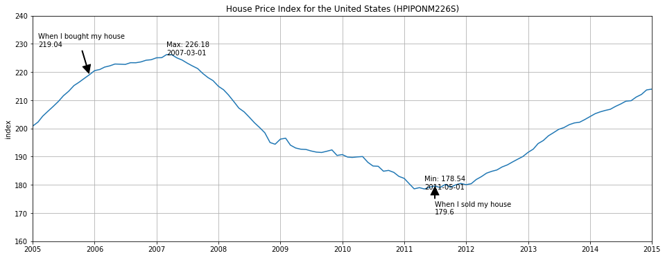


This is a basic example of annotations, there are a variety of other annotation options - See
[Basic annotation](https://matplotlib.org/users/annotations.html#annotations-tutorial) and
[Advanced Annotation](https://matplotlib.org/users/annotations.html#plotting-guide-annotation) for details.

## Logarithmic and other nonlinear axes
---
matplotlib.pyplot supports not only linear axis scales, but also logarithmic and logit scales. This is commonly
used if data spans many orders of magnitude.  Changing the scale of an axis is done with `plt.xscale()`:

    plt.xscale('log')

An example of four plots with the same data and different scales for the y axis is shown below.

~~~
from matplotlib.ticker import NullFormatter  # useful for `logit` scale

# Fixing random state for reproducibility
np.random.seed(19680801)

# make up some data in the interval ]0, 1[
y = np.random.normal(loc=0.5, scale=0.4, size=1000)
y = y[(y > 0) & (y < 1)]
y.sort()
x = np.arange(len(y))

# plot with various axes scales
plt.figure(1)

# linear
plt.subplot(221)
plt.plot(x, y)
plt.yscale('linear')
plt.title('linear')
plt.grid(True)


# log
plt.subplot(222)
plt.plot(x, y)
plt.yscale('log')
plt.title('log')
plt.grid(True)


# symmetric log
plt.subplot(223)
plt.plot(x, y - y.mean())
plt.yscale('symlog', linthreshy=0.01)
plt.title('symlog')
plt.grid(True)

# logit
plt.subplot(224)
plt.plot(x, y)
plt.yscale('logit')
plt.title('logit')
plt.grid(True)
# Format the minor tick labels of the y-axis into empty strings with
# `NullFormatter`, to avoid cumbering the axis with too many labels.
plt.gca().yaxis.set_minor_formatter(NullFormatter())
# Adjust the subplot layout, because the logit one may take more space
# than usual, due to y-tick labels like "1 - 10^{-3}"
plt.subplots_adjust(top=0.92, bottom=0.08, left=0.10, right=0.95, hspace=0.25,
                    wspace=0.35)

plt.show()
~~~
{: .python}
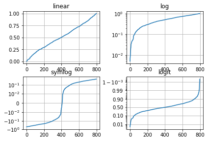
